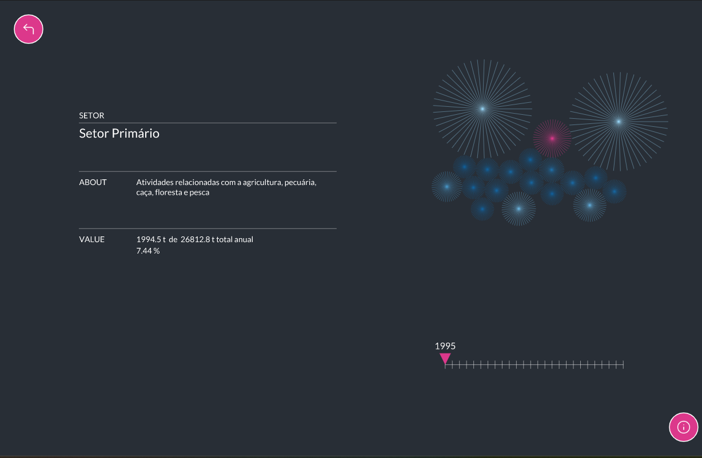
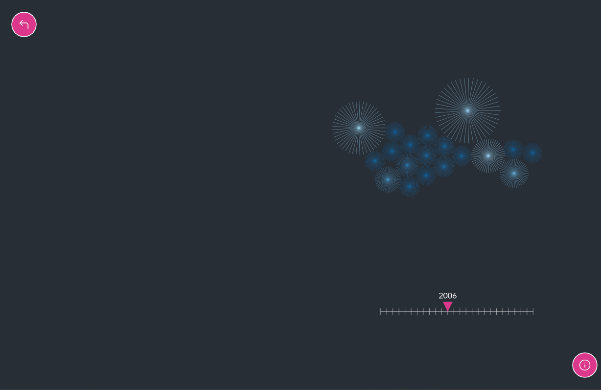

<!--
**air-polution-portugal/air-polution-portugal**
-->

<h1>Intensidade Carbónica da Economia</h1>

<h4> Portugal | 1995 - 2020</h4>

<!-- SUBSTITUIR CASO FAÇAMOS ALTERAÇÕES-->
<!--

O projeto Intensidade Carbónica da Economia - Portugal 1995-2020 tem como principal propósito/finalidade/objetivo criar uma visualização de dados interativa relativa à intensidade carbónica dos diversos setores de atividade económica em Portugal.

Assim, parte-se de um conjunto de dados, (disponível aqui [<ins>https://www.pordata.pt/portugal/intensidade+carbonica+da+economia+por+setor+de+atividade-3477</ins>](https://www.pordata.pt/portugal/intensidade+carbonica+da+economia+por+setor+de+atividade-3477) ) referentes ao período entre 1995 e 2020, que indica “quanto dióxido de carbono e outros gases causadores do aquecimento global são emitidos, em toneladas, por cada milhão de euros de riqueza criada.

O objetivo final desta visualização de dados é ilustrar, de forma visual, intuitiva e de fácil/rápida interpretação, de que forma é que a poluição causada por cada um destes setores foi evoluindo ao longo de 25 anos. Desta forma, é possível, ao utilizador, perceber que alguns setores extremamente poluentes em 1995 (nomeadamente o Setor Energético e  o de Captação, Tratamento e Distribuição de Água) são atualmente mais amigos do ambiente (eco-friendly); embora, em 2020 o setor mais poluente seja ainda o de Captação, Tratamento e Distribuição de Água. Através da identificação dos setores mais poluentes, o público/utilizador pode perceber onde/sobre que setores devem ser tomadas medidas com vista a reduzir a pegada ecológica.

A visualização dos dados é construída para um ano de cada vez (anualmente?), dependendo da interação do utilizador, é então apresentado um conjunto de partículas (representadas por uma forma esférica/circular, com linhas que nascem do seu centro), cada uma representativa de um determinado setor de atividade económica. O tamanho da partícula é exponencialmente proporcional ao respetivo valor da intensidade carbónica do seu setor - quanto maior for a partícula, mais poluente é o setor.

Em adição, o utilizador tem a oportunidade de selecionar cada partícula para obter informações mais pormenorizada sobre esse setor (como a percentagem de gases causadores do aquecimento global emitidos relativamente ao total anual). 

Esta visualização de dados, integralmente desenvolvida em P5.js (JavaScript), é ainda um work in progress, tratando-se de uma nova forma de interpretar e representar os dados originais, fazendo uso da tecnologia para os recodificar numa componente visual e interativa e intuitiva, de muito mais fácil leitura para o ser humano.

-->

<!--

 Imagens - Interação 

-->

**Fonte de recolha de dados**
 [here](https://www.pordata.pt/portugal/intensidade+carbonica+da+economia+por+setor+de+atividade-3477) :)
 

**Dados**
 [here](https://github.com/air-polution-portugal/air-polution-portugal.github.io/blob/main/00-Dados.csv) :)

 Info - Sectors 

 

[( 0 ) Primary Sector](https://eportugal.gov.pt/categorias-de-actividade/agrc-anml-flrst-pesca)
 
[( 1 ) Extractive Industries](https://eportugal.gov.pt/categorias-de-actividade/extrativas)
 
[( 2 ) Manufacturing](https://eportugal.gov.pt/categorias-de-actividade/transformadoras)
 
[( 3 ) Energy](https://eportugal.gov.pt/categorias-de-actividade/elet-gas-vap-quen-frio)
 
[( 4 ) Water Capture, Treatment and Distribution](https://www.gee.gov.pt/pt/lista-publicacoes/estatisticas-setoriais/e-captacao-tratamento-e-distribuicao-de-agua-saneamento-gestao-de-residuos-e-despoluicao/36-captacao-tratamento-e-distribuicao-de-agua)
 
[( 5 ) Construction](https://eportugal.gov.pt/categorias-de-actividade/construcao)
 
[( 6 ) Tertiary Sector](https://eportugal.gov.pt/categorias-de-actividade/grossis-retalho-repar-auto-moto)
 
[( 7 ) Transport and Storage](https://eportugal.gov.pt/categorias-de-actividade/transporte-armazenam)
 
[( 8 ) Housing and Catering](https://eportugal.gov.pt/categorias-de-actividade/alojam-restaur)
 
[( 9 ) Information and Communication](https://eportugal.gov.pt/categorias-de-actividade/inform-comunic)
 
[( 10 ) Financial and Insurance Activities](https://eportugal.gov.pt/categorias-de-actividade/financeiro)
 
[( 11 ) Real Estate Activities](https://eportugal.gov.pt/categorias-de-actividade/imobiliario)
 
[( 12 ) Consulting, Scientific, Technical](https://eportugal.gov.pt/categorias-de-actividade/consult-cient-tecnic-similar)
 
[( 13 ) Administrative and Support Service Activities](https://eportugal.gov.pt/categorias-de-actividade/admin-apoio)
 
[( 14 ) Public Administration](https://dados.gov.pt/pt/datasets/administracao-publica-e-defesa-seguranca-social-obrigatoria/)
 
[( 15 ) Education](https://eportugal.gov.pt/categorias-de-actividade/educacao)
 
[( 16 ) Human Health Activities and Social Support](https://eportugal.gov.pt/categorias-de-actividade/saude-apoiosocial)
 
[( 17 ) Arts, Entertainment, Sports](https://eportugal.gov.pt/categorias-de-actividade/arte-desp-recreacao)
 
[( 18 ) Other Services](https://eportugal.gov.pt/categorias-de-actividade/outros-servpessoais)
 

**Biblioteca - C2.js**
 [here](https://c2js.org/) :)
 

 Tools 

 

Microsoft Excel: Tabela de dados

Papel e Papis: Esboços e Wireframes

Figma: Desenvolvimento de protótipo high fidelity 

P5js: Elaboração do projeto interativo 

[Library - C2.js](https://c2js.org/)

 

<!--

Moodboard & Referências

 

Key Workers
  
 [Behance](https://www.behance.net/gallery/99331127/Key-WorkersMigrants-contributionto-COVID-19-response) / [Vimeo](https://vimeo.com/431452723?embedded=true&source=vimeo_logo&owner=6931780)

 

Hearts and Minds
 
[Behance](https://www.behance.net/gallery/133409063/Hearts-and-minds) / [Vimeo](https://vimeo.com/657826393?embedded=true&source=vimeo_logo&owner=6931780)

 

The Mayors Dialogue on Growth and Solidarity
 
[Behance](https://www.behance.net/gallery/111133627/The-Mayors-Dialogue-on-Growth-and-Solidarity) / [Vimeo](https://vimeo.com/499241639?embedded=true&source=vimeo_logo&owner=6931780)

 

Noise Pollution
 
[Behance](https://www.behance.net/gallery/96908251/Noise-pollution)

 

Energy Demand and the Rhythm of Everyday Life
 
[Behance](https://www.behance.net/gallery/153326341/Energy-demand-and-the-rhythm-of-everyday-life)

 

The Deepest Lakes
 
[Behance](https://www.behance.net/gallery/148418917/The-deepest-lakes)

 

Life in 2050 Ident
 
[Vimeo](https://vimeo.com/10924639)

 

<!-- [Visualizing the Digits of Pi](https://www.youtube.com/watch?v=WEd_UIKG-uc&list=PLdmBHU4Jaa1j3S_FDImTyLgnHittN6XEI&index=32)

 

<!-- 

  -->

Institute of Fine Arts Dissertations
 
[Behance](https://yining1023.github.io/IFA/projects/ifa-dissertation/) / [Site](https://yining1023.github.io/IFA/projects/ifa-dissertation/)

 

Um ecossistema POLÍTICO-EMPRESARIAL
 
[Site](https://pmcruz.com/eco/)

  
 
 -cene
 
[Site](http://pmcruz.com/works/-cene.html)

 

Visualizing Empires Decline
 
[Site](http://pmcruz.com/works/visualizing-empires-decline.html)

 -->

Esboços

Versões Anteriores

Wireframes

<!--

To do List (para um futuro próximo) 

- [x] Particles - Formato & Cores

- [x] Manter o MouseIsPressed (selecionar) nas Particles

- [x] Pop-up - Legenda de Compração

- [x] Slider
    - [x] Legenda

- [ ] Tornar Responsive
     - [ ] Mobile Layout
     - [x] Particles Spawn

- [ ]  Escrever Textos
     - [x] Título Projeto
     - [ ] Texto Intro
     - [ ] Textos Setores
     - [x] Alterar Nomes Setores

- [x] Botões

 To do List  (para um futuro não tão próximo :) )

- [x] Tornar Responsive (Cont.)
    - [x] TextBoxes
    - [x] Organizar Particles - Point vs Line
  
- [x] Scene Intro - Particles

- [ ] PT vs EN (2 Versões?)

- [ ] Slider
    - [x] Interação Pointer
    - [ ] Interação on MouseRelleased

-->
<!--

Referências

**

References:

\- PEARSON, Matt. (2011). Generative Art - a pratical guide using processing. Manning Publications;

\- SHIFFMAN, Daniel. (2019, fevereiro, 25). Coding Challenge #123.1: Polar Perlin Noise Loops. Youtube. https://www.youtube.com/watch?v=ZI1dmHv3MeM;

\- SHOEMAKER, Maxin. (2021, fevereiro, 21). Creative Coding Tutorial: Golden Ratio Sunflower Spiral in P5.js (Javascript). Youtube. https://www.youtube.com/watch?v=RrSOv9FH6uo&t=496s;

**
<details-->

Developers:
     
    _Carolina Mendonça | nº 3200349
     
    _Eduardo Vitorino | nº 3200337

