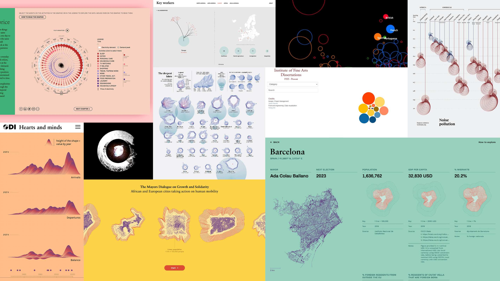
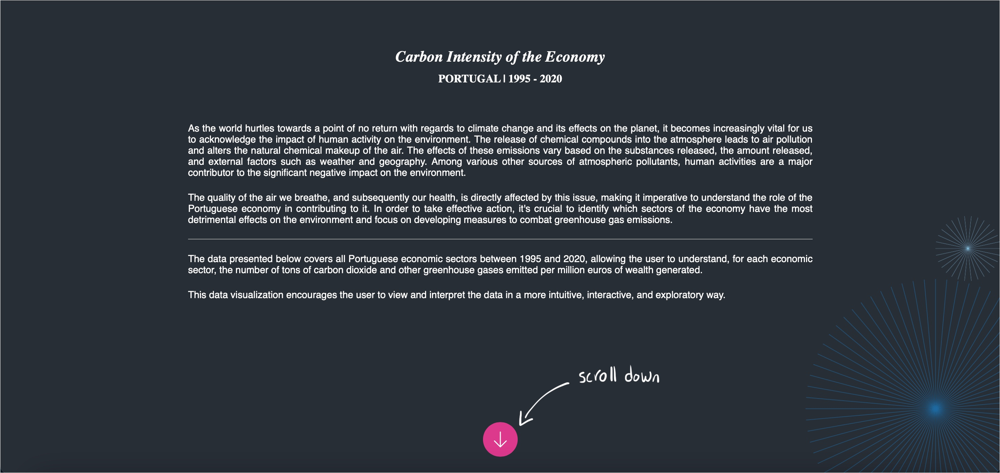
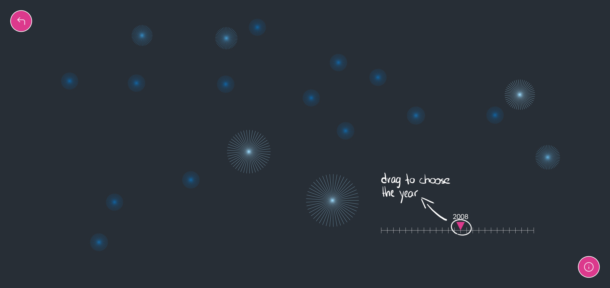
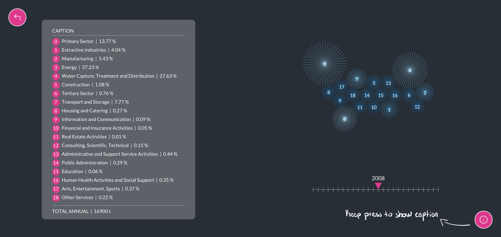
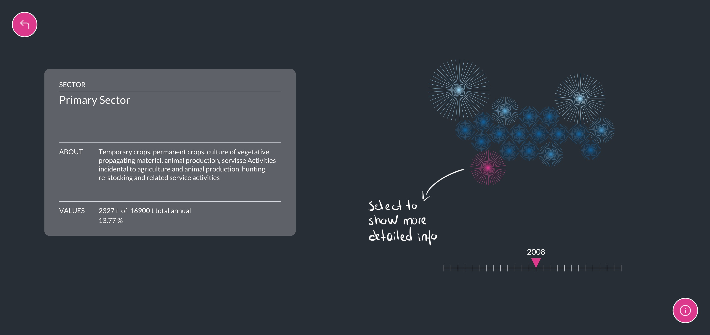
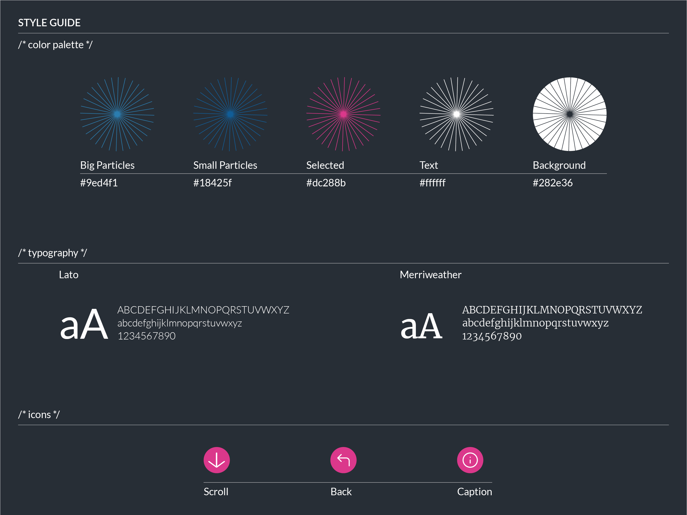

<!--
**air-polution-portugal/air-polution-portugal**
-->

<h1>Carbon Intensity of the Economy</h1>

<h2> Portugal | 1995 - 2020</h2>

<h3> About </h3>

    The Carbon Intensity of the Economy - Portugal 1995-2020 project's main purpose is to provide an interactive data visualization of the carbon intensity of all economic sectors in Portugal. The project's dataset \[1\] relates to the period between 1995 and 2020, which indicates "how much carbon dioxide and other greenhouse gasses are emitted, in tons, for each million euros of wealth created" (PORDATA 2022). The ultimate goal of this project is to reveal, in a visual, intuitive, explanatory and interactive way, how the pollution levels caused by each of these sectors has evolved over 25 years. Thus, it is possible for the user to understand that some extremely polluting sectors in 1995 (namely the Energy Sector and the Water Capture, Treatment and Distribution Sector) are currently more eco-friendly; although, in 2020, the most polluting sector is still the Water Capture, Treatment and Distribution Sector. Through the identification of the most polluting sectors, the user can understand which sectors should be taken into account to reduce the ecological footprint. This visualization presentes its data one year at a time (depending on the user's interaction). A set of particles (represented by a circular shape, with lines emanating from its center) are then created, each one representative of an economic sector. The size of the particle is exponentially proportional to the respective value of the carbon intensity of its sector - the bigger the particle, the more polluting the sector is. In addition, the user has the opportunity to select each particle to obtain more detailed information about the selected sector (such as the percentage of greenhouse gasses emitted relative to the annual total). This data visualization, fully developed in p5.js (JavaScript), introduces a new way of interpreting and representing the data, It recodes the set of numeric values (data), into a visual, interactive and explainable narrative.

<h3> Contextualization </h3>

    As the world hurtles towards a point of no return with regards to climate change and its effects on the planet, it becomes increasingly vital for us to acknowledge the impact of human activity on the environment. The release of chemical compounds into the atmosphere leads to air pollution and alters the natural chemical makeup of the air. The effects of these emissions vary based on the substances released, the amount released, and external factors such as weather and geography. Among various other sources of atmospheric pollutants, human activities are a major contributor to the significant negative impact on the environment.
     
    The quality of the air we breathe, and subsequently our health, is directly affected by this issue, making it imperative to understand the role of the Portuguese economy in contributing to it. In order to take effective action, it's crucial to identify which sectors of the economy have the most detrimental effects on the environment and focus on developing measures to combat greenhouse gas emissions.
     
     
    The data presented below covers all Portuguese economic sectors between 1995 and 2020, allowing the user to understand, for each economic sector, the number of tons of carbon dioxide and other greenhouse gases emitted per million euros of wealth generated.
     
    This data visualization encourages the user to view and interpret the data in a more intuitive, interactive, and exploratory way.

Moodboard

 

 

 Sketches 

Wireframes

 Process 

 

 

 Tools 

 

Microsoft Excel: Data Table

 

Paper and Pencil: Sketches

 

Figma: High-fidelity prototype (Wireframes)

 

P5.js: Code

 

[Library - C2.js](https://c2js.org/)

 

How to use

 

 

 

 

 

Style Guide

 

 

 Data 

 
[Data source](https://www.pordata.pt/portugal/intensidade+carbonica+da+economia+por+setor+de+atividade-3477)
 

[Data table](https://github.com/air-polution-portugal/air-polution-portugal.github.io/blob/main/00-Dados.csv)

 Info Sectors 

 

[( 0 ) Primary Sector](https://eportugal.gov.pt/categorias-de-actividade/agrc-anml-flrst-pesca)
 
[( 1 ) Extractive Industries](https://eportugal.gov.pt/categorias-de-actividade/extrativas)
 
[( 2 ) Manufacturing](https://eportugal.gov.pt/categorias-de-actividade/transformadoras)
 
[( 3 ) Energy](https://eportugal.gov.pt/categorias-de-actividade/elet-gas-vap-quen-frio)
 
[( 4 ) Water Capture, Treatment and Distribution](https://www.gee.gov.pt/pt/lista-publicacoes/estatisticas-setoriais/e-captacao-tratamento-e-distribuicao-de-agua-saneamento-gestao-de-residuos-e-despoluicao/36-captacao-tratamento-e-distribuicao-de-agua)
 
[( 5 ) Construction](https://eportugal.gov.pt/categorias-de-actividade/construcao)
 
[( 6 ) Tertiary Sector](https://eportugal.gov.pt/categorias-de-actividade/grossis-retalho-repar-auto-moto)
 
[( 7 ) Transport and Storage](https://eportugal.gov.pt/categorias-de-actividade/transporte-armazenam)
 
[( 8 ) Housing and Catering](https://eportugal.gov.pt/categorias-de-actividade/alojam-restaur)
 
[( 9 ) Information and Communication](https://eportugal.gov.pt/categorias-de-actividade/inform-comunic)
 
[( 10 ) Financial and Insurance Activities](https://eportugal.gov.pt/categorias-de-actividade/financeiro)
 
[( 11 ) Real Estate Activities](https://eportugal.gov.pt/categorias-de-actividade/imobiliario)
 
[( 12 ) Consulting, Scientific, Technical](https://eportugal.gov.pt/categorias-de-actividade/consult-cient-tecnic-similar)
 
[( 13 ) Administrative and Support Service Activities](https://eportugal.gov.pt/categorias-de-actividade/admin-apoio)
 
[( 14 ) Public Administration](https://dados.gov.pt/pt/datasets/administracao-publica-e-defesa-seguranca-social-obrigatoria/)
 
[( 15 ) Education](https://eportugal.gov.pt/categorias-de-actividade/educacao)
 
[( 16 ) Human Health Activities and Social Support](https://eportugal.gov.pt/categorias-de-actividade/saude-apoiosocial)
 
[( 17 ) Arts, Entertainment, Sports](https://eportugal.gov.pt/categorias-de-actividade/arte-desp-recreacao)
 
[( 18 ) Other Services](https://eportugal.gov.pt/categorias-de-actividade/outros-servpessoais)
 

 References 

 

- CRUZ, Pedro & SHIBUYA, Felipe.(n.d.) _[] cene_. [Here]([<ins>http://pmcruz.com/works/-cene.html</ins>](http://pmcruz.com/works/-cene.html));

 

- CRUZ, Pedro. _Visualizing Empires Decline_.(n.d.) [Here](http://pmcruz.com/works/visualizing-empires-decline.html);

 

- CRUZ, Pedro & WIHBEY, John & GHAEL, Avni & SHIBUYA, Felipe. Simulated Dendrochronology of U.S. immigration.(n.d.) [Here](https://pmcruz.com/dendrochronology/);

 

- CRUZ, Pedro. Um ecossistema POLÍTICO-EMPRESARIAL. [Here](https://pmcruz.com/eco/);

 

- FRAGAPANE, Federica. (2022)._Energy demand and the rhythm of everyday life_. Behance. [Here](https://www.behance.net/gallery/153326341/Energy-demand-and-the-rhythm-of-everyday-life);

 

- FRAGAPANE, Federica. (2022).The deepest lakes. Behance. [<ins>https://www.behance.net/gallery/148418917/The-deepest-lakes</ins>](https://www.behance.net/gallery/148418917/The-deepest-lakes);

 

- PEARSON, Matt. (2009).Life in 2050 Ident. Vimeo. [<ins>https://vimeo.com/10924639?login=true</ins>](https://vimeo.com/10924639?login=true);

 

- VARONE, Jason. Institute of Fine Arts Dissertations. Site. [<ins>https://yining1023.github.io/IFA/projects/ifa-dissertation/</ins>](https://yining1023.github.io/IFA/projects/ifa-dissertation/);

 

- CRUZ, Pedro. Um ecossistema POLÍTICO-EMPRESARIAL. Site. [<ins>https://pmcruz.com/eco/</ins>](https://pmcruz.com/eco/);

 

- CRUZ, Pedro & SHIBUYA, Felipe.  { }cene. Site. [<ins>http://pmcruz.com/works/-cene.html</ins>](http://pmcruz.com/works/-cene.html);

 

- CRUZ, Pedro.  Visualizing Empires Decline. Site. [<ins>http://pmcruz.com/works/visualizing-empires-decline.html</ins>](http://pmcruz.com/works/visualizing-empires-decline.html);

 

- PEARSON, Matt. (2011). Generative Art - a pratical guide using processing. Manning Publications;

 

- SHIFFMAN, Daniel. (2019, fevereiro, 25). Coding Challenge #123.1: Polar Perlin Noise Loops. Youtube. https://www.youtube.com/watch?v=ZI1dmHv3MeM;

Developers:
     
    _Carolina Mendonça | nº 3200349
     
    _Eduardo Vitorino | nº 3200337

