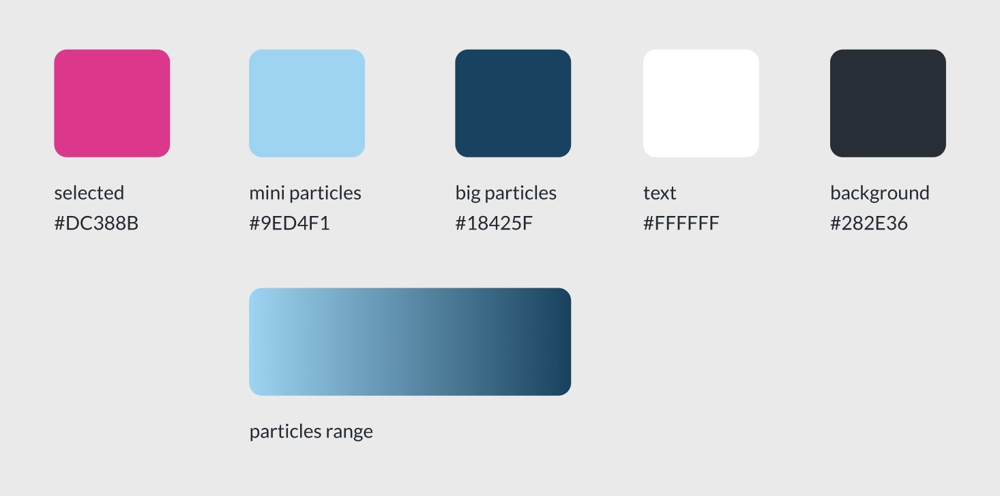

<!--
**air-polution-portugal/air-polution-portugal**
-->

<h1>Intensidade Carbónica da Economia</h1>

<h4> Portugal | 1995 - 2020</h4>

<!-- SUBSTITUIR CASO FAÇAMOS ALTERAÇÕES-->
<!--

O projeto Intensidade Carbónica da Economia - Portugal 1995-2020 tem como principal propósito/finalidade/objetivo criar uma visualização de dados interativa relativa à intensidade carbónica dos diversos setores de atividade económica em Portugal.

Assim, parte-se de um conjunto de dados, (disponível aqui [<ins>https://www.pordata.pt/portugal/intensidade+carbonica+da+economia+por+setor+de+atividade-3477</ins>](https://www.pordata.pt/portugal/intensidade+carbonica+da+economia+por+setor+de+atividade-3477) ) referentes ao período entre 1995 e 2020, que indica “quanto dióxido de carbono e outros gases causadores do aquecimento global são emitidos, em toneladas, por cada milhão de euros de riqueza criada.

O objetivo final desta visualização de dados é ilustrar, de forma visual, intuitiva e de fácil/rápida interpretação, de que forma é que a poluição causada por cada um destes setores foi evoluindo ao longo de 25 anos. Desta forma, é possível, ao utilizador, perceber que alguns setores extremamente poluentes em 1995 (nomeadamente o Setor Energético e  o de Captação, Tratamento e Distribuição de Água) são atualmente mais amigos do ambiente (eco-friendly); embora, em 2020 o setor mais poluente seja ainda o de Captação, Tratamento e Distribuição de Água. Através da identificação dos setores mais poluentes, o público/utilizador pode perceber onde/sobre que setores devem ser tomadas medidas com vista a reduzir a pegada ecológica.

A visualização dos dados é construída para um ano de cada vez (anualmente?), dependendo da interação do utilizador, é então apresentado um conjunto de partículas (representadas por uma forma esférica/circular, com linhas que nascem do seu centro), cada uma representativa de um determinado setor de atividade económica. O tamanho da partícula é exponencialmente proporcional ao respetivo valor da intensidade carbónica do seu setor - quanto maior for a partícula, mais poluente é o setor.

Em adição, o utilizador tem a oportunidade de selecionar cada partícula para obter informações mais pormenorizada sobre esse setor (como a percentagem de gases causadores do aquecimento global emitidos relativamente ao total anual). 

Esta visualização de dados, integralmente desenvolvida em P5.js (JavaScript), é ainda um work in progress, tratando-se de uma nova forma de interpretar e representar os dados originais, fazendo uso da tecnologia para os recodificar numa componente visual e interativa e intuitiva, de muito mais fácil leitura para o ser humano.

-->

**Info - Data**
 [here](https://www.pordata.pt/portugal/intensidade+carbonica+da+economia+por+setor+de+atividade-3477) :)
 

**Table - Data**
 [here](https://github.com/air-polution-portugal/air-polution-portugal.github.io/blob/main/00-Dados.csv) :)

 Info Sectors 

 

[( 0 ) Primary Sector](https://eportugal.gov.pt/categorias-de-actividade/agrc-anml-flrst-pesca)
 
[( 1 ) Extractive Industries](https://eportugal.gov.pt/categorias-de-actividade/extrativas)
 
[( 2 ) Manufacturing](https://eportugal.gov.pt/categorias-de-actividade/transformadoras)
 
[( 3 ) Energy](https://eportugal.gov.pt/categorias-de-actividade/elet-gas-vap-quen-frio)
 
[( 4 ) Water Capture, Treatment and Distribution](https://www.gee.gov.pt/pt/lista-publicacoes/estatisticas-setoriais/e-captacao-tratamento-e-distribuicao-de-agua-saneamento-gestao-de-residuos-e-despoluicao/36-captacao-tratamento-e-distribuicao-de-agua)
 
[( 5 ) Construction](https://eportugal.gov.pt/categorias-de-actividade/construcao)
 
[( 6 ) Tertiary Sector](https://eportugal.gov.pt/categorias-de-actividade/grossis-retalho-repar-auto-moto)
 
[( 7 ) Transport and Storage](https://eportugal.gov.pt/categorias-de-actividade/transporte-armazenam)
 
[( 8 ) Housing and Catering](https://eportugal.gov.pt/categorias-de-actividade/alojam-restaur)
 
[( 9 ) Information and Communication](https://eportugal.gov.pt/categorias-de-actividade/inform-comunic)
 
[( 10 ) Financial and Insurance Activities](https://eportugal.gov.pt/categorias-de-actividade/financeiro)
 
[( 11 ) Real Estate Activities](https://eportugal.gov.pt/categorias-de-actividade/imobiliario)
 
[( 12 ) Consulting, Scientific, Technical](https://eportugal.gov.pt/categorias-de-actividade/consult-cient-tecnic-similar)
 
[( 13 ) Administrative and Support Service Activities](https://eportugal.gov.pt/categorias-de-actividade/admin-apoio)
 
[( 14 ) Public Administration](https://dados.gov.pt/pt/datasets/administracao-publica-e-defesa-seguranca-social-obrigatoria/)
 
[( 15 ) Education](https://eportugal.gov.pt/categorias-de-actividade/educacao)
 
[( 16 ) Human Health Activities and Social Support](https://eportugal.gov.pt/categorias-de-actividade/saude-apoiosocial)
 
[( 17 ) Arts, Entertainment, Sports](https://eportugal.gov.pt/categorias-de-actividade/arte-desp-recreacao)
 
[( 18 ) Other Services](https://eportugal.gov.pt/categorias-de-actividade/outros-servpessoais)
 

 Tools 

 

Microsoft Excel: Table Data

Papel e Papis: Sketches - Wireframes

Figma: High-fidelity prototype 

P5js: Code 

 [Library - C2.js](https://c2js.org/) 

 

Style Guide

 

 

 

Moodboard

 

 

How to use

 

 

 

 

 

 Sketches 

Sequence - Old Version

 

 

Wireframes

Referências

 References 

 

- FRAGAPANE, Federica & PIACENTINI, Alex. (2020). Hearts and minds. Behance. [<ins>https://www.behance.net/gallery/99331127/Key-WorkersMigrants-contributionto-COVID-19-response</ins>](https://www.behance.net/gallery/99331127/Key-WorkersMigrants-contributionto-COVID-19-response)

 

- FRAGAPANE, Federica & PIACENTINI, Alex. (2021). Coding Challenge #123.1: Polar Perlin Noise Loops. Behance. [<ins>https://www.behance.net/gallery/133409063/Hearts-and-minds</ins>](https://www.behance.net/gallery/133409063/Hearts-and-minds);

 

- FRAGAPANE, Federica & PIACENTINI, Alex. (2021). The Mayors Dialogue on Growth and Solidarity. Behance. [<ins>https://www.behance.net/gallery/111133627/The-Mayors-Dialogue-on-Growth-and-Solidarity</ins>](https://www.behance.net/gallery/111133627/The-Mayors-Dialogue-on-Growth-and-Solidarity);

 

- FRAGAPANE, Federica. (2020). Noise pollution. Behance. [<ins>https://www.behance.net/gallery/96908251/Noise-pollution</ins>](https://www.behance.net/gallery/96908251/Noise-pollution);

 

- FRAGAPANE, Federica. (2022).Energy demand and the rhythm of everyday life. Behance. [<ins>https://www.behance.net/gallery/153326341/Energy-demand-and-the-rhythm-of-everyday-life</ins>](https://www.behance.net/gallery/153326341/Energy-demand-and-the-rhythm-of-everyday-life);

 

- FRAGAPANE, Federica. (2022).The deepest lakes. Behance. [<ins>https://www.behance.net/gallery/148418917/The-deepest-lakes</ins>](https://www.behance.net/gallery/148418917/The-deepest-lakes);

 

- PEARSON, Matt. (2009).Life in 2050 Ident. Vimeo. [<ins>https://vimeo.com/10924639?login=true</ins>](https://vimeo.com/10924639?login=true);

 

- VARONE, Jason. Institute of Fine Arts Dissertations. Site. [<ins>https://yining1023.github.io/IFA/projects/ifa-dissertation/</ins>](https://yining1023.github.io/IFA/projects/ifa-dissertation/);

 

- CRUZ, Pedro. Um ecossistema POLÍTICO-EMPRESARIAL. Site. [<ins>https://pmcruz.com/eco/</ins>](https://pmcruz.com/eco/);

 

- CRUZ, Pedro & SHIBUYA, Felipe.  { }cene. Site. [<ins>http://pmcruz.com/works/-cene.html</ins>](http://pmcruz.com/works/-cene.html);

 

- CRUZ, Pedro.  Visualizing Empires Decline. Site. [<ins>http://pmcruz.com/works/visualizing-empires-decline.html</ins>](http://pmcruz.com/works/visualizing-empires-decline.html);

 

Developers:
     
    _Carolina Mendonça | nº 3200349
     
    _Eduardo Vitorino | nº 3200337

