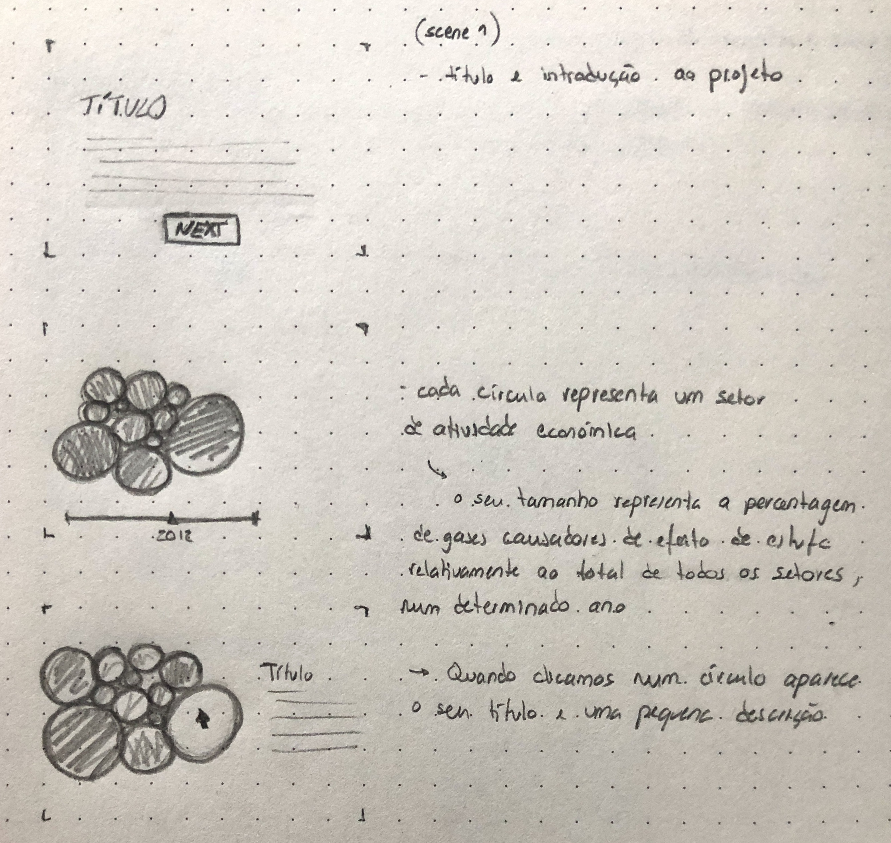

<!--
**air-polution-portugal/air-polution-portugal**
-->

<h1>Intensidade Carbónica da Economia</h1>

<h4> Portugal | 1995 - 2020</h4>

Developers:
    _Carolina Mendonça | nº 3200349
     
    _Eduardo Vitorino | nº 3200337

<!--
 O projeto “Intensidade Carbónica da Economia” tem como propósito mostrar de forma interativa a intensidade carbónica em diversos setores de atividade em Portugal.

O principal objetivo deste projeto é mostrar de forma interativa como cada setor evoluiu ao longo de 25 anos (1995 - 2020), com a visualização conseguimos perceber quais são os setores que aumentaram e diminuíram as emissões(?) carbónicas e outros gases para a atmosfera, identificando assim quais são os mais poluentes.

A visualização baseia-se em um gráfico de partículas que são constituídas por linhas que nascem a partir do centro, as partículas podem aumentar ou diminuir o tamanho consoante a quantidade de gases imitidos durante o ano apresentado, este gráfico é acompanhado de um slider que serve para alterar o ano. Para iniciar a interação é necessário clicar em uma das diversas partículas, de seguida é mostrado uma breve descrição do setor juntamente com os dados referentes ao mesmo e a comparada com o valor anual acompanhado da percentagem, por fim, adicionamos um botão que mostra uma tabela numerada para saber exatamente onde se situa cada setor no gráfico, acompanhado do nome e valor emitido.

-->

<!--

 Imagens - Interação 

-->

**Fonte de recolha de dados**
 [here](https://www.pordata.pt/portugal/intensidade+carbonica+da+economia+por+setor+de+atividade-3477) :)
 

**Dados**
 [here](https://github.com/air-polution-portugal/air-polution-portugal.github.io/blob/main/00-Dados.csv) :)

 Info - Setores 

 

[( 0 ) Setor Primário](https://eportugal.gov.pt/categorias-de-actividade/agrc-anml-flrst-pesca)
 
[( 1 ) Indústrias Extrativas](https://eportugal.gov.pt/categorias-de-actividade/extrativas)
 
[( 2 ) Indústrias Transformadoras](https://eportugal.gov.pt/categorias-de-actividade/transformadoras)
 
[( 3 ) Setor Energético](https://eportugal.gov.pt/categorias-de-actividade/elet-gas-vap-quen-frio)
 
[( 4 ) Captação, Tratamento e Distribuição de Água](https://www.gee.gov.pt/pt/lista-publicacoes/estatisticas-setoriais/e-captacao-tratamento-e-distribuicao-de-agua-saneamento-gestao-de-residuos-e-despoluicao/36-captacao-tratamento-e-distribuicao-de-agua)
 
[( 5 ) Construção](https://eportugal.gov.pt/categorias-de-actividade/construcao)
 
[( 6 ) Comércio](https://eportugal.gov.pt/categorias-de-actividade/grossis-retalho-repar-auto-moto)
 
[( 7 ) Transportes e Armazenagem](https://eportugal.gov.pt/categorias-de-actividade/transporte-armazenam)
 
[( 8 ) Alojamento, Restauração e Similáres](https://eportugal.gov.pt/categorias-de-actividade/alojam-restaur)
 
[( 9 ) Atividades de Informação e de Comunicação](https://eportugal.gov.pt/categorias-de-actividade/inform-comunic)
 
[( 10 ) Atividades Financeiras e de Seguros](https://eportugal.gov.pt/categorias-de-actividade/financeiro)
 
[( 11 ) Atividades Imobiliárias](https://eportugal.gov.pt/categorias-de-actividade/imobiliario)
 
[( 12 ) Atividades de Consultoria, Científicas, Técnicas e Similares](https://eportugal.gov.pt/categorias-de-actividade/consult-cient-tecnic-similar)
 
[( 13 ) Atividades Administrativas e dos Serviços de Apoio](https://eportugal.gov.pt/categorias-de-actividade/admin-apoio)
 
[( 14 ) Administração Pública e Defesa, e Segurança Social obrigatória](https://dados.gov.pt/pt/datasets/administracao-publica-e-defesa-seguranca-social-obrigatoria/)
 
[( 15 ) Educação](https://eportugal.gov.pt/categorias-de-actividade/educacao)
 
[( 16 ) Atividades de Saúde Humana e Apoio Social](https://eportugal.gov.pt/categorias-de-actividade/saude-apoiosocial)
 
[( 17 ) Atividades Artísticas, de Espetáculos, Desportivas e Recreativas](https://eportugal.gov.pt/categorias-de-actividade/arte-desp-recreacao)
 
[( 18 ) Outras Atividades de Serviços](https://eportugal.gov.pt/categorias-de-actividade/outros-servpessoais)
 

**Biblioteca - C2.js**
 [here](https://c2js.org/) :)
 

 Ferramentas 

 

Microsoft Excel: Tabela de dados

Papel e Papis: Esboços e Wireframes

Figma: Desenvolvimento de protótipo high fidelity 

P5js: Elaboração do projeto interativo 

 

Moodboard & Referências

 

Key Workers
  
 [Behance](https://www.behance.net/gallery/99331127/Key-WorkersMigrants-contributionto-COVID-19-response) / [Vimeo](https://vimeo.com/431452723?embedded=true&source=vimeo_logo&owner=6931780)

 

Hearts and Minds
 
[Behance](https://www.behance.net/gallery/133409063/Hearts-and-minds) / [Vimeo](https://vimeo.com/657826393?embedded=true&source=vimeo_logo&owner=6931780)

 

The Mayors Dialogue on Growth and Solidarity
 
[Behance](https://www.behance.net/gallery/111133627/The-Mayors-Dialogue-on-Growth-and-Solidarity) / [Vimeo](https://vimeo.com/499241639?embedded=true&source=vimeo_logo&owner=6931780)

 

Noise Pollution
 
[Behance](https://www.behance.net/gallery/96908251/Noise-pollution)

 

Energy Demand and the Rhythm of Everyday Life
 
[Behance](https://www.behance.net/gallery/153326341/Energy-demand-and-the-rhythm-of-everyday-life)

 

The Deepest Lakes
 
[Behance](https://www.behance.net/gallery/148418917/The-deepest-lakes)

 

Life in 2050 Ident
 
[Vimeo](https://vimeo.com/10924639)

 

<!-- [Visualizing the Digits of Pi](https://www.youtube.com/watch?v=WEd_UIKG-uc&list=PLdmBHU4Jaa1j3S_FDImTyLgnHittN6XEI&index=32)

 

<!-- 

  -->

Institute of Fine Arts Dissertations
 
[Behance](https://yining1023.github.io/IFA/projects/ifa-dissertation/) / [Site](https://yining1023.github.io/IFA/projects/ifa-dissertation/)

 

Um ecossistema POLÍTICO-EMPRESARIAL
 
[Site](https://pmcruz.com/eco/)

  
 
 -cene
 
[Site](http://pmcruz.com/works/-cene.html)

 

Visualizing Empires Decline
 
[Site](http://pmcruz.com/works/visualizing-empires-decline.html)

Esboços

Versões Anteriores

Wireframes

To do List (para um futuro próximo) 

- [x] Particles - Formato & Cores

- [x] Manter o MouseIsPressed (selecionar) nas Particles

- [x] Pop-up - Legenda de Compração

- [x] Slider
    - [x] Legenda

- [ ] Tornar Responsive
     - [ ] Mobile Layout
     - [x] Particles Spawn

- [ ]  Escrever Textos
     - [x] Título Projeto
     - [ ] Texto Intro
     - [ ] Textos Setores
     - [x] Alterar Nomes Setores

- [x] Botões

 To do List  (para um futuro não tão próximo :) )

- [x] Tornar Responsive (Cont.)
    - [x] TextBoxes
    - [x] Organizar Particles - Point vs Line
  
- [x] Scene Intro - Particles

- [ ] PT vs EN (2 Versões?)

- [ ] Slider
    - [x] Interação Pointer
    - [ ] Interação on MouseRelleased

