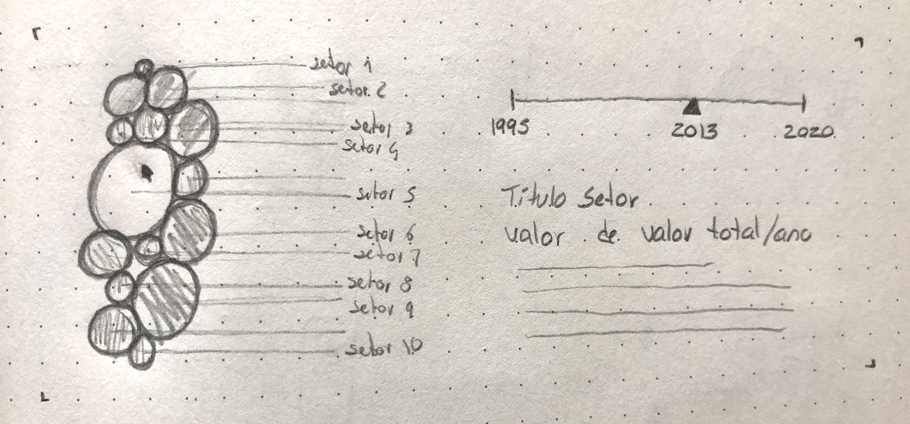

<!--
**air-polution-portugal/air-polution-portugal**
-->

**Fonte de recolha de dados**
 [here](https://www.pordata.pt/portugal/intensidade+carbonica+da+economia+por+setor+de+atividade-3477)
 

**Dados**
 [here](https://github.com/air-polution-portugal/air-polution-portugal.github.io/blob/main/00-Dados.csv)
 

**Esboços**

**Wireframes**

**WireFrame Figma**

**Wireframes**

**To do List**_(para um futuro próximo)_

- [x] Particles - Formato & Cores

- [x] Manter o MouseIsPressed (selecionar) nas Particles

- [x] Pop-up - Legenda de Compração

- [x] Slider
    - [x] Legenda

- [ ] Tornar Responsive
     - [ ] Mobile Layout
     - [x] Particles Spawn

- [ ]  Escrever Textos
     - [ ] Título Projeto
     - [ ] Texto Intro
     - [ ] Textos Setores
     - [x] Alterar Nomes Setores

- [ ] Botões

 To do List _(para um futuro não tão próximo :) )

- [x] Tornar Responsive (Cont.)
    - [x] TextBoxes
    - [x] Organizar Particles - Point vs Line
  
- [ ] Scene Intro - Particles (?)

- [ ] PT vs EN (2 Versões?)

- [ ] Slider
    - [ ] Interação Pointer
    - [ ] Interação on MouseRelleased

